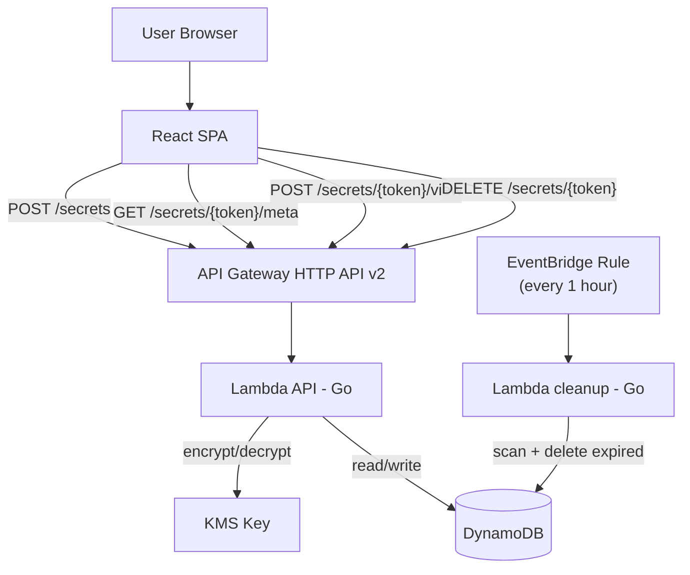

# PWPass

Generate secure passwords and share them securely.

## Architecture

## Deploying

### Prerequisites

- AWS account with an S3 bucket for Terraform state
- Required secrets: `AWS_ACCESS_KEY_ID`, `AWS_SECRET_ACCESS_KEY`, `TF_STATE_BUCKET`
