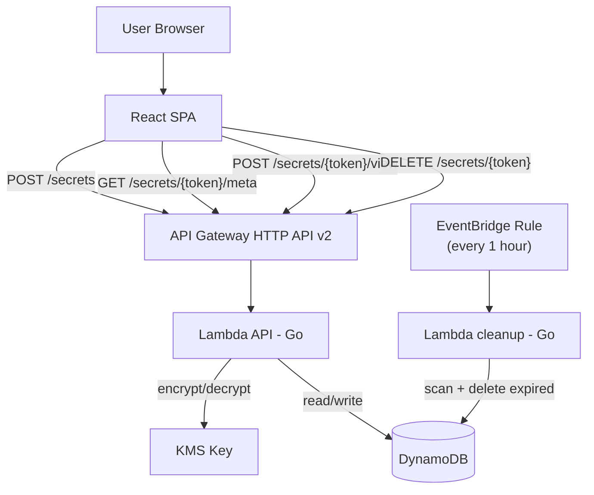
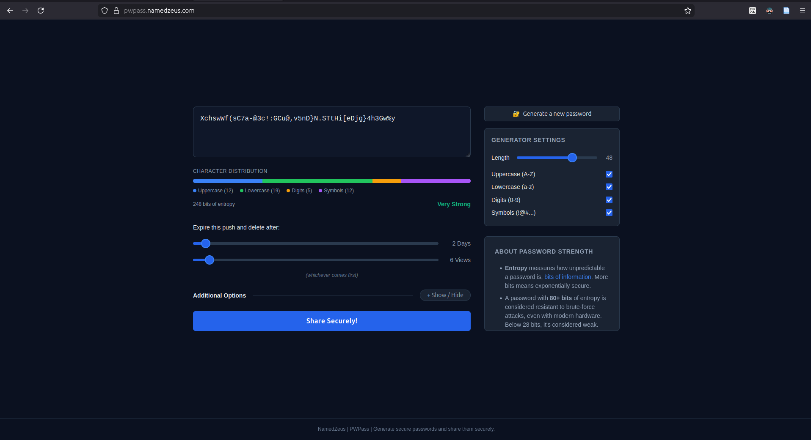
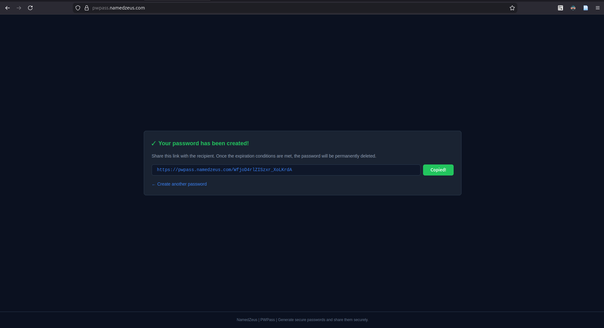
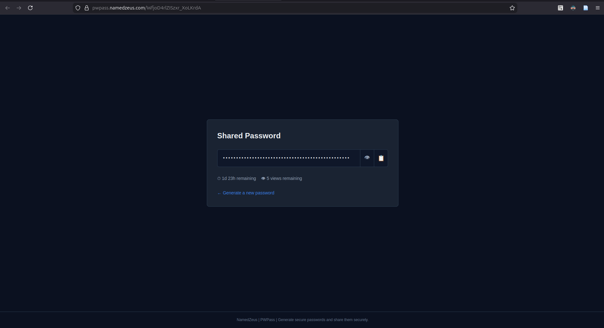
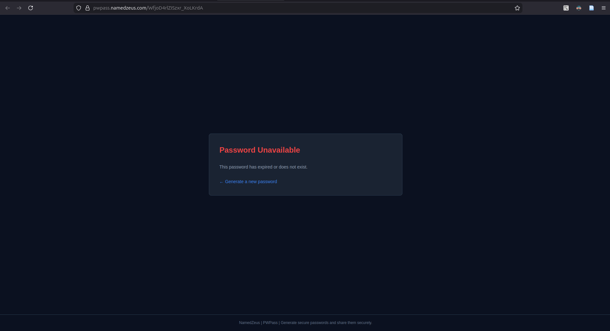

# PWPass

Generate secure passwords and share them securely.

## Architecture

## Screenshots

| Generate & configure | Share link ready |
|---|---|
|  |  |

| Recipient view | Expired link |
|---|---|
|  |  |

## Design Decisions

**Password generation happens entirely in the browser.**
The server never sees a candidate password before the user decides to share it. If generation were server-side, every "generate" click would send a request, and the server could log or intercept the value before the user even decided to use it. By using the Web Crypto API (`crypto.getRandomValues`) directly in the browser, the password exists only in the user's tab until they explicitly hit "Share Securely".

**Secrets are encrypted at rest with AWS KMS.**
The Lambda function encrypts the secret content with a KMS key before writing it to DynamoDB, and decrypts it only when someone provides the correct token (and optional passphrase). This means that even if someone got raw access to the DynamoDB table, they'd have ciphertext with no way to decrypt it without going through IAM-controlled KMS.

**Secrets expire by two independent limits: time and view count.**
A link that expires in 2 days but can be viewed 6 times covers the common case of sharing with a small team. Using only a time limit would leave the secret accessible to anyone who finds the link during that window, using only a view count would leave it accessible forever if nobody opens it. The combination means the secret disappears as soon as it becomes unnecessary.

**An optional passphrase adds a second factor.**
The share link is the "something you have". A passphrase is the "something you know". If the link leaks (forwarded email, chat history, shoulder surfing), the passphrase keeps the secret safe. It's opt-in because most single-use shares don't need it, and friction is a real cost.

**The "allow deletion" toggle is opt-in by the sender, not the recipient.**
When sharing a password, the sender can choose to let the recipient delete it early, but only if the sender explicitly allows it. This keeps control with the person who created the secret: if you're sharing a credential with a colleague and don't want them to accidentally nuke it before everyone on the team has retrieved it, you just leave the option off. When deletion is allowed, a "Delete Now" button appears on the view page, giving the recipient a clean way to revoke the link once they no longer need it.

**A separate cleanup Lambda handles expired secrets.**
Rather than checking expiration on every read request, an EventBridge rule fires every hour and scans for expired rows. This keeps the read path simple and avoids the cost of conditional deletes on hot paths. The trade-off is that expired secrets can sit in DynamoDB for up to an hour after their TTL, acceptable here since the API already rejects reads on expired secrets.

## Deploying

### Prerequisites

Required secrets: `AWS_ACCESS_KEY_ID`, `AWS_SECRET_ACCESS_KEY`, `TF_STATE_BUCKET`
