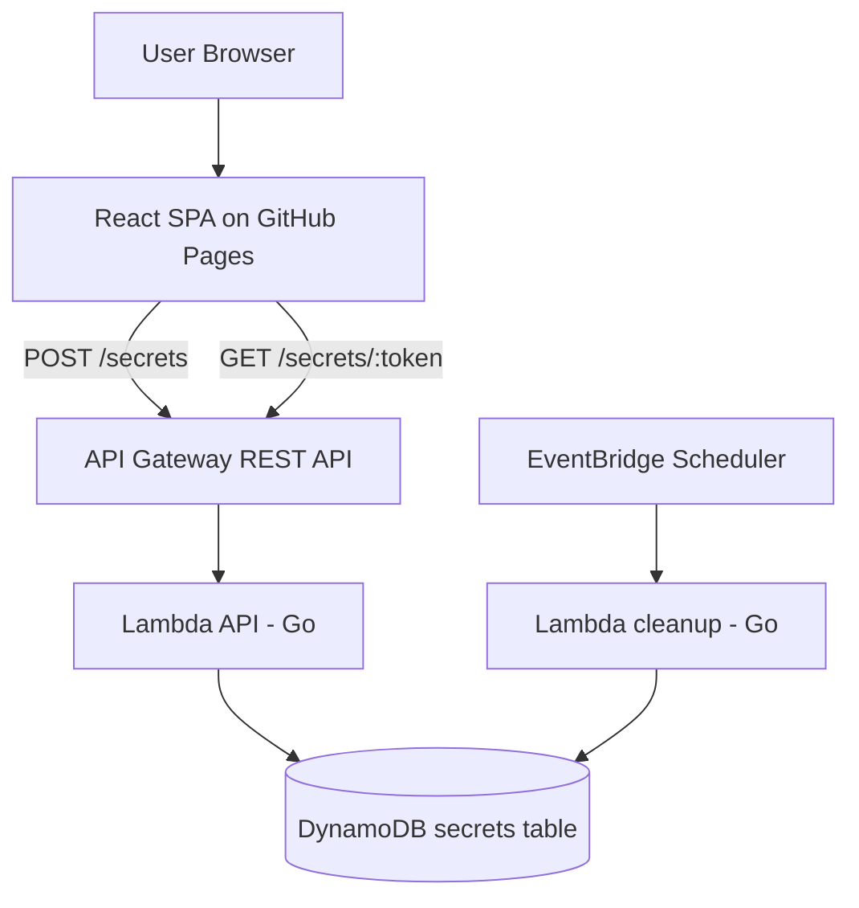

# pwpass

Generate passwords and share them securely.

# backend

```mermaid
flowchart TD
    U[User Browser] --> FE[React SPA on GitHub Pages]
    FE -->|POST /secrets| APIGW[API Gateway REST API]
    FE -->|GET /secrets/:token| APIGW

    APIGW --> API[Lambda API - Go]
    API --> DDB[(DynamoDB secrets table)]

    SCH[EventBridge Scheduler] --> CLEAN[Lambda cleanup - Go]
    CLEAN --> DDB
```
